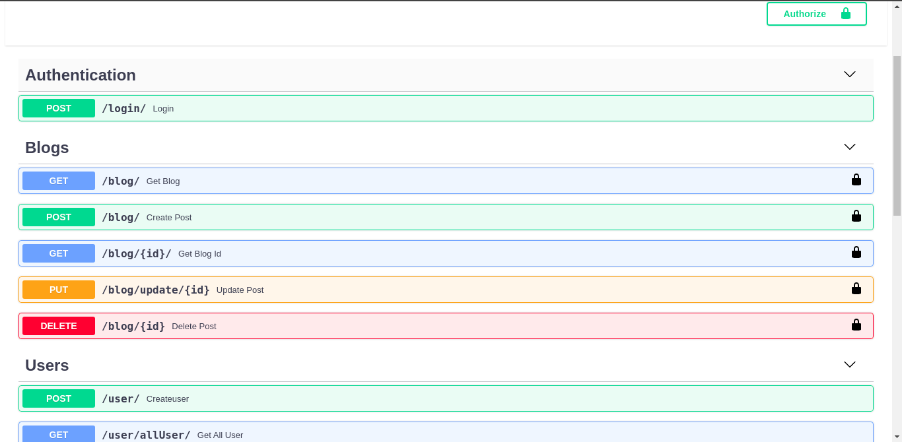
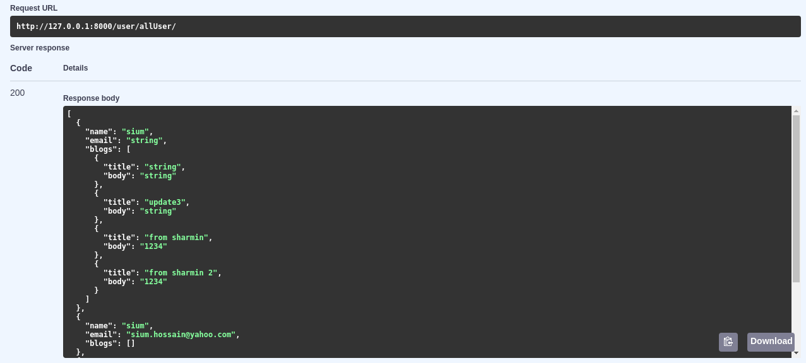

# crud_functionality_in_fastApi

Implement crud functionality using fastApi

## Screen shot 📸




## Usage
* Create folder
  ```bash
  mkdir foldername
  ```

* Create Virtualenv
  ```py
  python3 -m venv x
  ```
* Activate Virtualenv
  ```bash
  source x/bin/activate
  ```
* Clone this project
  ```bash
  git clone https://github.com/siumhossain/crud_functionality_in_fastApi
  ```
* Requirements installation
  ```py
  pip3 -r requirements.txt
  ```
* Create Database
  ```bash
  touch sql.db
  ```
  Go to database.py and change this line for connect with database
  
  SQLALCHEMY_DATABASE_URL = "sqlite:///./sql.db"
  
* Change security key 
  ```bash
  openssl rand -hex 32
  ```
  paste this key to : `routers/token.py` --> `SECRET_KEY = "enter your security key"`
  
* Run 
  ```bash
  uvicorn main:app --reload
  ```

Doc link for this API --> [click here](http://127.0.0.1:8000/docs)

Fast API doc --> [click here](https://fastapi.tiangolo.com/)
  
