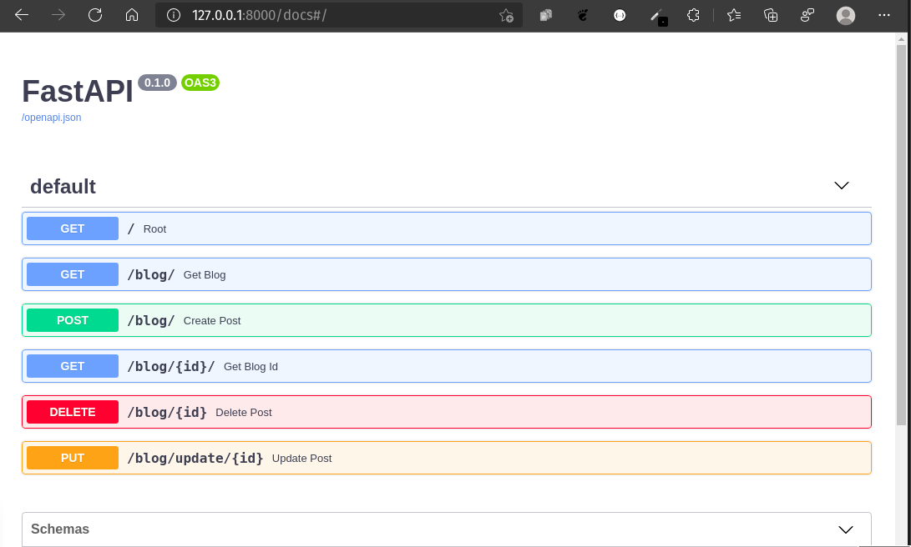

# crud_functionality_in_fastApi

Implement crud functionality using fastApi

## Screen shot 📸



## Usage
* Create folder
  ```bash
  mkdir foldername
  ```

* Create Virtualenv
  ```py
  python3 -m venv x
  ```
* Activate Virtualenv
  ```bash
  source x/bin/activate
  ```
* Clone this project
  ```bash
  git clone https://github.com/siumhossain/crud_functionality_in_fastApi
  ```
* Requirements installation
  ```py
  pip3 -r requirements.txt
  ```
